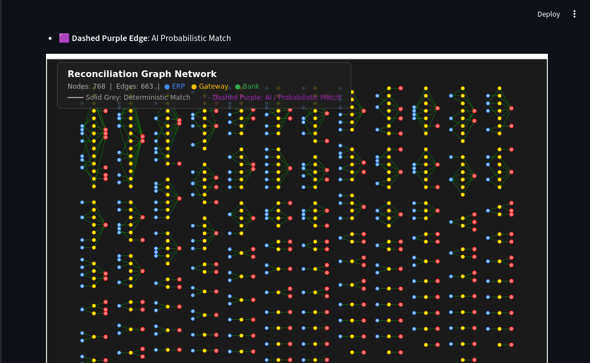
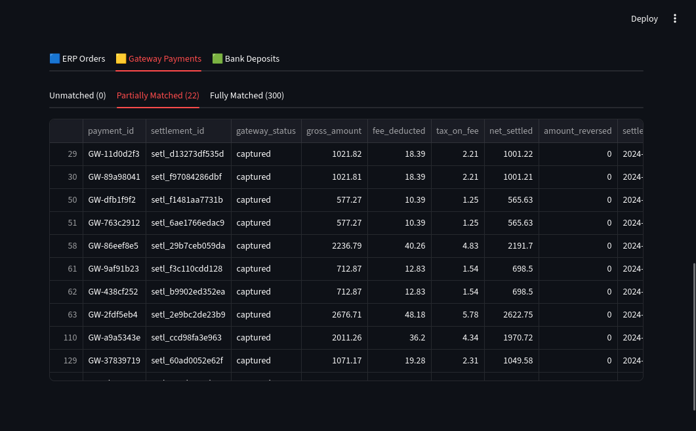

# Multi-Source Reconciliation Agent

Reconciles financial records in a three way situation of merchant ERP, payment gateway, and bank. Uses deterministic engine and AI based clustering to reconcile ERP receipts, payment gateway settlements, and bank statements. Supports one-to-one, one-to-many, many-to-one, and many-to-many relationships between records for both ERP-Gateway and Gateway-Bank reconcilaiation.


# Running

## Github Codespaces

[](https://codespaces.new/lakshya-sr/transaction-reconcile)

```bash
python main.py --all

python main.py --dashboard
```

## Windows

```powershell
# Clone repository
git clone https://github.com/lakshya-sr/transaction-reconcile.git
cd transaction-reconcile

# Create virtual environment
python -m venv .venv
.venv\Scripts\activate

# Install dependencies
pip install -r requirements.txt

# Run full pipeline
python main.py --all

# Launch dashboard
python main.py --dashboard
```

## Linux

### 1. `pip` based

```bash
# Clone repository
git clone https://github.com/lakshya-sr/transaction-reconcile.git
cd transaction-reconcile

# Create virtual environment
python -m venv .venv
source .venv/bin/activate

# Install dependencies
pip install -r requirements.txt

# Run full pipeline
python main.py --all

# Launch dashboard
python main.py --dashboard
```

### 2. `uv` based

```bash
# Clone repository
git clone https://github.com/lakshya-sr/transaction-reconcile.git
cd transaction-reconcile

# Install dependencies with uv
uv pip install -r requirements.txt

# Run full pipeline
uv run main.py --all

# Launch dashboard
uv run main.py --dashboard
```

## MacOS (not tested)

```bash
# Clone repository
git clone https://github.com/lakshya-sr/transaction-reconcile.git
cd transaction-reconcile

# Create virtual environment
python3 -m venv .venv
source .venv/bin/activate

# Install dependencies
pip install -r requirements.txt

# Run full pipeline
python main.py --all

# Launch dashboard
python main.py --dashboard
```

## Available Commands

| Command | Description |
|---------|-------------|
| `python main.py --generate` | Generate synthetic data |
| `python main.py --setup-db` | Initialize database |
| `python main.py --match` | Run deterministic matching |
| `python main.py --infer` | Run AI inference |
| `python main.py --evaluate` | Evaluate accuracy |
| `python main.py --benchmark` | Performance profiling |
| `python main.py --dashboard` | Launch Streamlit UI |
| `python main.py --all` | Run entire pipeline |
| `python demo.py` | Step-by-step demo |


# Architecture Overview

The reconciliation pipeline processes transactions through sequential stages, each handling increasingly complex matching scenarios.

## Pipeline Flow

```
┌─────────────────────────────────────────────────────────────────┐
│                    SYNTHETIC DATA GENERATION                    │
│  Simulates 3 sources with realistic noise (fees, delays, etc.) │
└──────────────────────────────┬──────────────────────────────────┘
                               ▼
┌─────────────────────────────────────────────────────────────────┐
│                      DATABASE INGESTION                         │
│  Loads raw records into SQLite with ground truth tables         │
└──────────────────────────────┬──────────────────────────────────┘
                               ▼
┌─────────────────────────────────────────────────────────────────┐
│                   DETERMINISTIC MATCHING                        │
│  • Exact identifier match (invoice, UTR, settlement ID)         │
│  • Subset sum for N:1 batch settlements                         │
│  • Connected-component sum balancing                            │
│  • Reserve split detection (85/15 MAIN/RSV)                     │
└──────────────────────────────┬──────────────────────────────────┘
                               ▼
┌─────────────────────────────────────────────────────────────────┐
│                       AI INFERENCE                              │
│  • Candidate cluster generation                                 │
│  • 11-feature extraction (amount, time, fuzzy scores)           │
│  • XGBoost scoring with calibrated threshold                    │
│  • Greedy conflict-free assignment                              │
└──────────────────────────────┬──────────────────────────────────┘
                               ▼
┌─────────────────────────────────────────────────────────────────┐
│                        EVALUATION                               │
│  • Precision / Recall / F1 against ground truth                 │
│  • Layer 1: ERP↔Gateway | Layer 2: Gateway↔Bank                 │
└──────────────────────────────┬──────────────────────────────────┘
                               ▼
┌─────────────────────────────────────────────────────────────────┐
│                   VISUALIZATION & REPORTING                     │
│  • Streamlit dashboard with graph network                       │
│  • Unreconciled records viewer                                  │
│  • Performance benchmark                                        │
└─────────────────────────────────────────────────────────────────┘
```
## Stage Details

### 1. Data Generation
Creates synthetic ERP, Gateway, and Bank records with ground truth edges. Injects realistic noise: MDR fees, GST, delayed settlements, corrupted UTRs, missing invoices, batch settlements, and reserve splits.

### 2. Deterministic Matching
Rule-based matching that catches ~70% of transactions:
- **Invoice matching**: Exact invoice number lookup with connected-component sum balancing
- **UTR matching**: Full and truncated UTR prefix matching
- **Settlement ID**: Direct identifier match
- **Subset sum**: Finds N:1 and 1:N combinations where amounts sum correctly
- **Amount + temporal**: Fallback for records with no identifiers

### 3. AI Inference
XGBoost handles residual unmatched records:
- **Candidate generation**: Blocks of potential matches within time/amount windows
- **Feature extraction**: 11 features including amount diffs, time deltas, UTR/invoice fuzzy scores
- **Model scoring**: Predicts match probability with 98% precision threshold
- **Assignment**: Greedy conflict-free matching

### 4. Evaluation
Compares predicted edges against ground truth:
- **Layer 1**: ERP↔Gateway precision/recall/F1
- **Layer 2**: Gateway↔Bank precision/recall/F1
- **False positive tracking**: Identifies incorrect matches by stage

### 5. Visualization
- Interactive graph showing ERP → Gateway → Bank chains
- Solid edges = deterministic, dashed = AI
- Suspense ledger for unreconciled records
- Performance benchmark with per-stage timing

# Gallery





